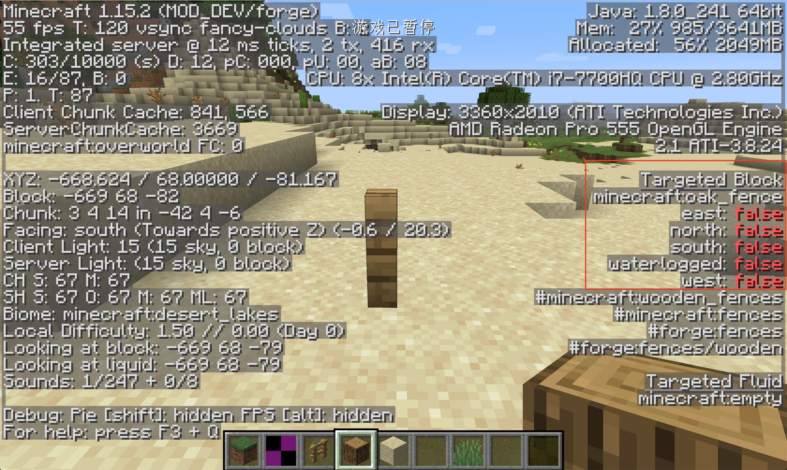

# Block and BlockState

Before starting our next explanation, I want to talk about the concept of `BlockState`. I believe you have already learned about `ItemStack`, and you should be able to understand this concept quickly.

Just as all the items in the game are actually `Itemstack`, all the blocks in the game are actually `BlockState`, and compared to `Block`, besides the extra XYZ position information, the most important thing is It is the `state` information, which is the state information. State information is difficult to understand at first glance, but it is actually very easy to understand. Let’s take the original fence as an example. When you put the original fence on the ground, the fence will automatically change its shape according to the surrounding squares. This is actually the fence automatically changed its state. We can check the state of the square in F3 debugging mode. .

This is the fence model in the default block state.

It can be seen that after we used the Debug Stick to modify the block state of the fence, the block model has also changed accordingly.

Of course, not all blocks have state attributes, such as stones do not, but position attributes are unique to every block.