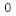
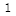

# Block with Blockstates

We have mentioned BlockState a bit before, but our first block is obviously stateless. In this section, we will use the obsidian cube as an example to create a block with state.

First create a class called `ObsidianRubikCube` with the following content:

```java
public class ObsidianRubikCube extends Block {
    private static IntegerProperty STATE = IntegerProperty.create("face", 0, 1);

    public ObsidianRubikCube() {
        super(Properties.create(Material.ROCK).hardnessAndResistance(5));
        this.setDefaultState(this.stateContainer.getBaseState().with(STATE, 1));
    }

    @Override
    protected void fillStateContainer(StateContainer.Builder<Block, BlockState> builder) {
        builder.add(STATE);
        super.fillStateContainer(builder);
    }
}
```

There are three things that are different from the box I created before. The first is:

```java
private static IntegerProperty STATE = IntegerProperty.create("face", 0, 1);
```

In this sentence, we created a new block state. As the name `IntegerProperty` implies, this is an integer type block state. In addition to the original version of `IntegerProperty`, it also implements `BooleanProperty` and `EnumProperty`, And the original version also implements many preset block states under the `BlockStateProperties` class, which can be used on demand. If these types do not meet your needs, you can also inherit `Property` to create a new type of block state yourself.

```java
IntegerProperty.create("face", 0, 1)
```

Means, the name of this block state is `face`, the minimum value is `0`, and the maximum value is `1`.

```java
@Override
protected void fillStateContainer(StateContainer.Builder<Block, BlockState> builder) {
  builder.add(STATE);
  super.fillStateContainer(builder);
}
```

hen we call the `add` method in the passed in `builder` variable in `fillStateContainer` to add a state to our block.

Finally, we set the default state in the constructor (you don’t have to set it).

```java
this.setDefaultState(this.stateContainer.getBaseState().with(STATE, 1));
```

Register Block

```java
public static final RegistryObject<Block> obsidianRubikCube = BLOCKS.register("obsidian_rubik_cube", ObsidianRubikCube::new);
```

Register items

```java
public static final RegistryObject<Item> obsidianRubikCube = ITEMS.register("obsidian_rubik_cube", () -> new BlockItem(BlockRegistry.obsidianRubikCube.get(), new Item.Properties().group(ModGroup.itemGroup)));
```

Next, create a json file with the same name as your block's registered name in the `blockstates` folder. We create `obsidian_rubik_cube.json` with the following content:

```json
{
  "variants": {
    "face=0": { "model": "boson:block/obsidian_rubik_cube_model_0" },
    "face=1": { "model": "boson:block/obsidian_rubik_cube_model_1" }
  }
}
```

As you can see, we have specified different models for different `face` values here, namely `obsidian_rubik_cube_model_0` and `obsidian_rubik_cube_model_1`. Please note that if you want to define multiple blockstate values, please separate them with commas without any spaces. For specific requirements, please refer to the chapter on [model](https://minecraft.gamepedia.com/Model#Block_models) in the Wiki.

Then we create two model files `obsidian_rubik_cube_model_0.json` and `obsidian_rubik_cube_model_1.json` under `models/block`.

`obsidian_rubik_cube_model_0.json`:

```json
{
  "parent": "block/cube_all",
  "textures": {
    "all": "boson:block/obsidian_rubik_cube_texture_0"
  }
}
```

`obsidian_rubik_cube_model_1.json`:

```json
{
  "parent": "block/cube_all",
  "textures": {
    "all": "boson:block/obsidian_rubik_cube_texture_1"
  }
}
```

You can see that it loads two different textures.

Then add the textures.

`obsidian_rubik_cube_texture_0.png`



`obsidian_rubik_cube_texture_1.png`



Finally, add content to our item model `obsidian_rubik_cube`:

```json
{
  "parent": "boson:block/obsidian_rubik_cube_model_1"
}
```

可以看到，随着我们用debug stick改变了方块的状态，方块的模型和材质也发生了改变。


[Source Code](https://github.com/FledgeXu/BosonSourceCode/tree/master/src/main/java/com/tutorial/boson/blockstate)

