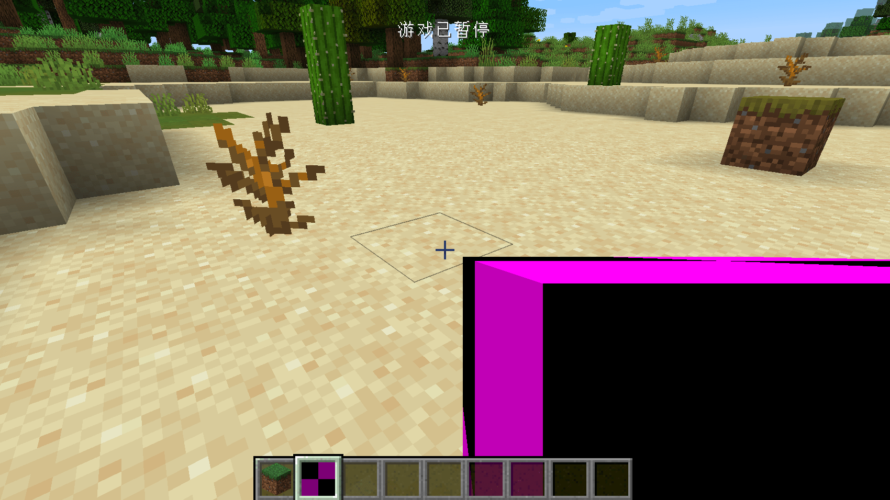

# First Block

In this section, we will create the simplest block, a block with no functions, even models and textures. Before I start, I must make a conceptual distinction, about the conceptual distinction between objects and squares. Anything you can hold in your hand is an "item", and it becomes a "block" only when it is placed in the world.


This is an item


This is a block.

Okay, we have made the difference between items and blocks clear. Next, let's create the first block, here we take the obsidian block as an example.

First create a class called `ObsidianBlock`, just like all custom items need to inherit the `Item` class, all custom methods need to inherit the `Block` class, please make sure your `Block` class is `net. Minecraft.block.Block` this class.

The specific content is as follows:

```java
public class ObsidianBlock extends Block {
    public ObsidianBlock() {
        super(Properties.create(Material.ROCK).hardnessAndResistance(5));
    }
}
```

The content is very simple. Just like `Item` has `Properties`, the block also needs a `Properties`. Unlike the item's `Properties`, the block's `Propeteis` needs to be created by calling the `create` method. Please note that although the two `Properties` have the same name, they are not in the same package. These are actually two different classes. The `create` method requires a parameter, which is a `Material` , `Material `Help you preset some characteristics of the block, such as whether it is solid, whether it is fluid, etc. You can override the features brought by `Material` by calling the method of `Properties`, here we use the original version of `Material.ROCK`, if you want to create a `Material` by yourself is very simple, please refer to the original implementation. Finally we call the `hardnessAndResistance` method to set the hardness for my block.

So far our obsidian block class has been created. Just as items need to be registered, my cubes also need to be registered.

Create a new registration class `BlockRegistry` with the following content:

```java
public class BlockRegistry {
    public static final DeferredRegister<Block> BLOCKS = DeferredRegister.create(ForgeRegistries.BLOCKS, Utils.MOD_ID);
    public static final RegistryObject<Block> obsidianBlock = BLOCKS.register("obsidian_block", ObsidianBlock::new);
}
```

I believe you who have written the registration class before should be relatively familiar with these contents. We replaced `DeferredRegister<Item>` with `DeferredRegister<Block>` (of course, the following instantiation parameters also need to be modified), so that we create a block register. The registration method is the same as the item registration, so I won't elaborate on it here.

You also need to register this register to the `mod` bus in your main class constructor.

```java
@Mod(Utils.MOD_ID)
public class Neutrino {
    public Neutrino() {
        ItemRegistry.ITEMS.register(FMLJavaModLoadingContext.get().getModEventBus());
        BlockRegistry.BLOCKS.register(FMLJavaModLoadingContext.get().getModEventBus());
    }
}
```

At this point, we have completed our block, now start the game, enter the following commands, and you can place your own squares.

```
/setblock ~ ~ ~ <ModID>:<Block Registry Name>
As our example 
/setblock ~ ~ ~ neutriono:obsidian_block
```


However, the blocks that can only be placed by commands are obviously not in our appetite. We hope that there is an item that can correspond to the blocks, so that we don’t need to use commands to place the blocks. For this common demand, Minecraft also provides a convenience To meet the requirements, this class is `BlockItem`, we only need to create and instantiate this class.

Let's go back to our `ItemRegistry` and add the following line

```java
public static final RegistryObject<Item> obsidianBlock = ITEMS.register("obsidian_block", () -> new BlockItem(BlockRegistry.obsidianBlock.get(), new Item.Properties().group(ModGroup.itemGroup)));
```

You can see that we have created an instance of BlockItem. Its construction method requires two parameters. The first parameter is the instance of the block you registered. We can get the registered one through `BlockRegistry.obsidianBlock.get()` Block instance, the second parameter is the `Properties` of an Item. The `Properties` here is very simple. We will add it to the creative inventory we created earlier.

Open the game at this time, and you can see our cubes in our creative mode inventory.




[Source Code](https://github.com/FledgeXu/BosonSourceCode/tree/master/src/main/java/com/tutorial/boson/first_block)