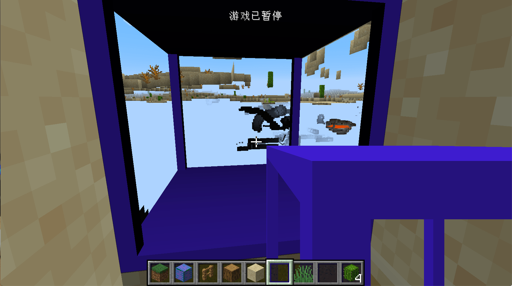

# Not Solid Block and custom model

In this section, we will create a transparent block with a special shape. Here we take the obsidian frame as an example.

First we create a class called `ObsidianFrame` with the following content:

```java
public class ObsidianFrame extends Block implements IWaterLoggable {
    private static final VoxelShape shape;
    private static final BooleanProperty WATERLOGGED = BooleanProperty.create("waterlogged");

    static {
        VoxelShape base = Block.makeCuboidShape(0, 0, 0, 16, 1, 16);
        VoxelShape column1 = Block.makeCuboidShape(0, 1, 0, 1, 15, 1);
        VoxelShape column2 = Block.makeCuboidShape(15, 1, 0, 16, 15, 1);
        VoxelShape column3 = Block.makeCuboidShape(0, 1, 15, 1, 15, 16);
        VoxelShape column4 = Block.makeCuboidShape(15, 1, 15, 16, 15, 16);
        VoxelShape top = Block.makeCuboidShape(0, 15, 0, 16, 16, 16);
        shape = VoxelShapes.or(base, column1, column2, column3, column4, top);
    }

    public ObsidianFrame() {
        super(Properties.create(Material.ROCK).hardnessAndResistance(5).notSolid());
        this.setDefaultState(this.stateContainer.getBaseState().with(WATERLOGGED, false));
    }

    @Override
    protected void fillStateContainer(StateContainer.Builder<Block, BlockState> builder) {
        builder.add(WATERLOGGED);
        super.fillStateContainer(builder);
    }

    @Override
    public VoxelShape getShape(BlockState state, IBlockReader worldIn, BlockPos pos, ISelectionContext context) {
        return shape;
    }

    @Nullable
    @Override
    public BlockState getStateForPlacement(BlockItemUseContext context) {
        BlockPos blockpos = context.getPos();
        BlockState blockstate = context.getWorld().getBlockState(blockpos);
        if (blockstate.isIn(this)) {
            return blockstate.with(WATERLOGGED, Boolean.valueOf(false));
        } else {
            FluidState fluidstate = context.getWorld().getFluidState(blockpos);
            BlockState blockstate1 = this.getDefaultState().with(WATERLOGGED, Boolean.valueOf(fluidstate.getFluid() == Fluids.WATER));
            return blockstate1;
        }
    }

    public BlockState updatePostPlacement(BlockState stateIn, Direction facing, BlockState facingState, IWorld worldIn, BlockPos currentPos, BlockPos facingPos) {
        if (stateIn.get(WATERLOGGED)) {
            worldIn.getPendingFluidTicks().scheduleTick(currentPos, Fluids.WATER, Fluids.WATER.getTickRate(worldIn));
        }
        return super.updatePostPlacement(stateIn, facing, facingState, worldIn, currentPos, facingPos);
    }

    @Override
    public FluidState getFluidState(BlockState state) {
        return state.get(WATERLOGGED) ? Fluids.WATER.getStillFluidState(false) : super.getFluidState(state);
    }
}
```

At the top we created a `VoxelShape`, we will return this shape in the `getShape` method. This `VoxelShape` is the collision box of our block. Unfortunately, the collision box of Minecraft can only be composed of blocks. The size of this box is `16*16*16`, so we created a series of cuboids and cubes by ourselves in the static code block to form the collision box of our block. The 6 parameters of `Block.makeCuboidShape` are respectively Is the XYZ of the starting point and the XYZ of the ending point. Finally, we put these things together using the `or` method of `VoxelShapes`. There are many useful space operation methods under `VoxelShapes`, please choose by yourself. If you don't set a suitable collision box for your block, the space inside your block will appear very dark.

It can be seen that the most special thing here is that the `notSoild` method is called. This method is to inform Minecraft that our block is not a "solid" block and needs special treatment. The reason for this is that there are so many blocks in the world of Minecraft. If every face of the block has to be rendered, including those that are occluded and blocks that are blocked, it will cost a lot of performance, so for optimization Considering that, Minecraft will only render those surfaces that are not blocked. The role of `noSoild` is to tell Minecraft to render the faces that are blocked by this block.

If this is not turned on, this effect will appear.



If you are interested in Minecraft block rendering-related content, you can read this blog [article](https://greyminecraftcoder.blogspot.com/2020/04/block-rendering-1144.html) and other articles under this blog.

After 1.13, Minecraft added the “water logged" feature. Many of the original incomplete blocks have this feature, and we can also add this feature to our blocks.

First, you need to make your block implement the interface `IWaterLoggable`:

```java
public class ObsidianFrame extends Block implements IWaterLoggable
```

Next you have to add a Boolean BlockState called `waterlogged` to your block.

```java
private static final BooleanProperty WATERLOGGED = BooleanProperty.create("waterlogged");

public ObsidianFrame() {
  super(Properties.create(Material.ROCK).hardnessAndResistance(5).notSolid());
  this.setDefaultState(this.stateContainer.getBaseState().with(WATERLOGGED, false));
}

@Override
protected void fillStateContainer(StateContainer.Builder<Block, BlockState> builder) {
  builder.add(WATERLOGGED);
  super.fillStateContainer(builder);
}
```

Next, implement the following block, the code is copied from the original half brick.

```java
@Nullable
@Override
public BlockState getStateForPlacement(BlockItemUseContext context) {
  BlockPos blockpos = context.getPos();
  BlockState blockstate = context.getWorld().getBlockState(blockpos);
  if (blockstate.isIn(this)) {
    return blockstate.with(WATERLOGGED, Boolean.valueOf(false));
  } else {
    FluidState fluidstate = context.getWorld().getFluidState(blockpos);
    BlockState blockstate1 = this.getDefaultState().with(WATERLOGGED, Boolean.valueOf(fluidstate.getFluid() == Fluids.WATER));
    return blockstate1;
  }
}

public BlockState updatePostPlacement(BlockState stateIn, Direction facing, BlockState facingState, IWorld worldIn, BlockPos currentPos, BlockPos facingPos) {
  if (stateIn.get(WATERLOGGED)) {
    worldIn.getPendingFluidTicks().scheduleTick(currentPos, Fluids.WATER, Fluids.WATER.getTickRate(worldIn));
  }
  return super.updatePostPlacement(stateIn, facing, facingState, worldIn, currentPos, facingPos);
}

@Override
public FluidState getFluidState(BlockState state) {
  return state.get(WATERLOGGED) ? Fluids.WATER.getStillFluidState(false) : super.getFluidState(state);
}
```

 But overall, the current design of the water logged block is more like a hack, so these implementations are a bit inexplicable...

Register Block:

```java
public static final RegistryObject<Block> obsidianFrame = BLOCKS.register("obsidian_frame", ObsidianFrame::new);
```

Register Item:

```java
public static RegistryObject<Item> obsidianFrame = ITEMS.register("obsidian_frame", () -> new BlockItem(BlockRegistry.obsidianFrame.get(), new Item.Properties().group(ModGroup.itemGroup)));
```

Then there is the blockstate file `obsidian_frame.json`:

```json
{
  "variants": {
    "": { "model": "bosons:block/obsidian_frame" }
  }
}
```

Model file `obsidian_frame.json`:

```json
{
	"texture_size": [64, 64],
	"textures": {
		"0": "boson:block/obsidian_frame",
		"particle": "boson:block/obsidian_frame"
	},
	"elements": [
		{
			"from": [0, 0, 0],
			"to": [16, 1, 16],
			"faces": {
				"north": {"uv": [4, 8.25, 8, 8.5], "texture": "#0"},
				"east": {"uv": [0, 8.25, 4, 8.5], "texture": "#0"},
				"south": {"uv": [12, 8.25, 16, 8.5], "texture": "#0"},
				"west": {"uv": [8, 8.25, 12, 8.5], "texture": "#0"},
				"up": {"uv": [8, 8.25, 4, 4.25], "texture": "#0"},
				"down": {"uv": [12, 4.25, 8, 8.25], "texture": "#0"}
			}
		},
		{
			"from": [0, 15, 0],
			"to": [16, 16, 16],
			"faces": {
				"north": {"uv": [4, 4, 8, 4.25], "texture": "#0"},
				"east": {"uv": [0, 4, 4, 4.25], "texture": "#0"},
				"south": {"uv": [12, 4, 16, 4.25], "texture": "#0"},
				"west": {"uv": [8, 4, 12, 4.25], "texture": "#0"},
				"up": {"uv": [8, 4, 4, 0], "texture": "#0"},
				"down": {"uv": [12, 0, 8, 4], "texture": "#0"}
			}
		},
		{
			"from": [0, 1, 0],
			"to": [1, 15, 1],
			"faces": {
				"north": {"uv": [2.25, 0.25, 2.5, 3.75], "texture": "#0"},
				"east": {"uv": [2, 0.25, 2.25, 3.75], "texture": "#0"},
				"south": {"uv": [2.75, 0.25, 3, 3.75], "texture": "#0"},
				"west": {"uv": [2.5, 0.25, 2.75, 3.75], "texture": "#0"},
				"up": {"uv": [2.5, 0.25, 2.25, 0], "texture": "#0"},
				"down": {"uv": [2.75, 0, 2.5, 0.25], "texture": "#0"}
			}
		},
		{
			"from": [15, 1, 0],
			"to": [16, 15, 1],
			"faces": {
				"north": {"uv": [1.25, 0.25, 1.5, 3.75], "texture": "#0"},
				"east": {"uv": [1, 0.25, 1.25, 3.75], "texture": "#0"},
				"south": {"uv": [1.75, 0.25, 2, 3.75], "texture": "#0"},
				"west": {"uv": [1.5, 0.25, 1.75, 3.75], "texture": "#0"},
				"up": {"uv": [1.5, 0.25, 1.25, 0], "texture": "#0"},
				"down": {"uv": [1.75, 0, 1.5, 0.25], "texture": "#0"}
			}
		},
		{
			"from": [0, 1, 15],
			"to": [1, 15, 16],
			"faces": {
				"north": {"uv": [0.25, 0.25, 0.5, 3.75], "texture": "#0"},
				"east": {"uv": [0, 0.25, 0.25, 3.75], "texture": "#0"},
				"south": {"uv": [0.75, 0.25, 1, 3.75], "texture": "#0"},
				"west": {"uv": [0.5, 0.25, 0.75, 3.75], "texture": "#0"},
				"up": {"uv": [0.5, 0.25, 0.25, 0], "texture": "#0"},
				"down": {"uv": [0.75, 0, 0.5, 0.25], "texture": "#0"}
			}
		},
		{
			"from": [15, 1, 15],
			"to": [16, 15, 16],
			"faces": {
				"north": {"uv": [3.25, 0.25, 3.5, 3.75], "texture": "#0"},
				"east": {"uv": [3, 0.25, 3.25, 3.75], "texture": "#0"},
				"south": {"uv": [3.75, 0.25, 4, 3.75], "texture": "#0"},
				"west": {"uv": [3.5, 0.25, 3.75, 3.75], "texture": "#0"},
				"up": {"uv": [3.5, 0.25, 3.25, 0], "texture": "#0"},
				"down": {"uv": [3.75, 0, 3.5, 0.25], "texture": "#0"}
			}
		}
	]
}
```

The texture file `obsidian_frame.png`:


Here my models and materials are made with BlockBench.

Item model `obsidian_frame.json`:

```json
{
  "parent": "boson:block/obsidian_frame"
}
```

Open the game, you should be able to see our obsidian frame.


And water logged block


[Source Code](https://github.com/FledgeXu/NeutrinoSourceCode/tree/master/src/main/java/com/tutorial/neutrino/nonesoildblock)

