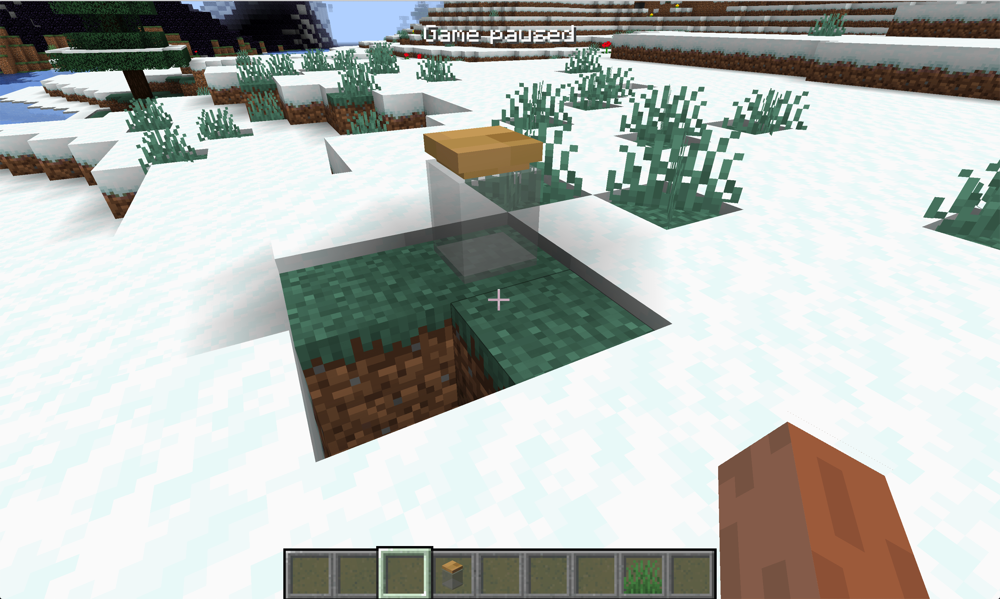

# Render Type

In this section, we will talk about the RenderType.


> Picture from [TheGreyGhost Blog](https://greyminecraftcoder.blogspot.com/2020/04/block-rendering-1144.html)

In Minecraft, there are four types of block rendering models, namely `translucent`, `solid`, `cutout` and `cutout_mipped`.

The general difference can be seen by everyone. Here we are going to detail the difference between `translucent` and `cutout*`. The difference between them is actually very simple, `translucent` is translucent, and `cutout*` is either fully transparent or opaque. You can pay attention to the difference between the white part on the glass and the white part on the ice cube.

The direct difference between `cutout` and `cutout_mipped` involves game optimization. `cutout_mipped` is `cutout` with Mipmapping enabled.

> In [computer graphics](https://en.wikipedia.org/wiki/Computer_graphics), **mipmaps** (also **MIP maps**) or **pyramids**[[1\]](https://en.wikipedia.org/wiki/Mipmap#cite_note-1)[[2\]](https://en.wikipedia.org/wiki/Mipmap#cite_note-2)[[3\]](https://en.wikipedia.org/wiki/Mipmap#cite_note-3) are pre-calculated, [optimized](https://en.wikipedia.org/wiki/Optimization_(computer_science)) sequences of [images](https://en.wikipedia.org/wiki/Digital_image), each of which is a progressively lower [resolution](https://en.wikipedia.org/wiki/Display_resolution) representation of the previous. The height and width of each image, or level, in the mipmap is a [power of two](https://en.wikipedia.org/wiki/Power_of_two) smaller than the previous level. Mipmaps do not have to be square. They are intended to increase [rendering](https://en.wikipedia.org/wiki/Rendering_(computer_graphics)) speed and reduce [aliasing](https://en.wikipedia.org/wiki/Aliasing) artifacts. A high-resolution mipmap image is used for high-density samples, such as for objects close to the camera; lower-resolution images are used as the object appears farther away. This is a more efficient way of downfiltering ([minifying](https://en.wikipedia.org/wiki/Magnification)) a [texture](https://en.wikipedia.org/wiki/Texture_mapping) than sampling all [texels](https://en.wikipedia.org/wiki/Texel_(graphics)) in the original texture that would contribute to a screen [pixel](https://en.wikipedia.org/wiki/Pixel); it is faster to take a constant number of samples from the appropriately downfiltered textures. Mipmaps are widely used in 3D [computer games](https://en.wikipedia.org/wiki/Computer_game), [flight simulators](https://en.wikipedia.org/wiki/Flight_simulator), other 3D imaging systems for [texture filtering](https://en.wikipedia.org/wiki/Texture_filtering) and 2D as well as 3D [GIS software](https://en.wikipedia.org/wiki/Geographical_information_system). Their use is known as **mipmapping**. The letters *MIP* in the name are an acronym of the [Latin](https://en.wikipedia.org/wiki/Latin) phrase *multum in parvo*, meaning "much in little".[[4\]](https://en.wikipedia.org/wiki/Mipmap#cite_note-staff-4)
>
> Since mipmaps, by definition, are pre-[allocated](https://en.wikipedia.org/wiki/Memory_management), additional [storage space](https://en.wikipedia.org/wiki/Computer_data_storage) is required to take advantage of them. They are also related to [wavelet compression](https://en.wikipedia.org/wiki/Wavelet_compression). Mipmap textures are used in 3D scenes to decrease the time required to render a scene. They also improve [image quality](https://en.wikipedia.org/wiki/Image_quality) by reducing aliasing and [Moiré patterns](https://en.wikipedia.org/wiki/Moiré_pattern) that occur at large viewing distances,[[5\]](https://en.wikipedia.org/wiki/Mipmap#cite_note-5) at the cost of [33%](https://en.wikipedia.org/wiki/1/4_%2B_1/16_%2B_1/64_%2B_1/256_%2B_⋯) more memory per texture.
>
> ——[Wikipedia](https://en.wikipedia.org/wiki/Mipmap)

We will take a glass jar as an example to teach you how to set the RenderType of the block.

First, let's create the Block, `GlassJar.java`:

```java
public class GlassJar extends Block {
    public GlassJar() {
        super(Properties.create(Material.ROCK).hardnessAndResistance(5).notSolid());
    }
}
```

Of course don't forget to register.

```java
public static final RegistryObject<GlassJar> glassJar = BLOCKS.register("glass_jar", GlassJar::new);
```

接下来就是设置我们方块的RenderType的地方，`RenderTypeRegistry`：

```java
@Mod.EventBusSubscriber(bus = Mod.EventBusSubscriber.Bus.MOD)
public class RenderTypeRegistry {
    @SubscribeEvent
    public static void onRenderTypeSetup(FMLClientSetupEvent event) {
        event.enqueueWork(() -> {
            RenderTypeLookup.setRenderLayer(BlockRegistry.glassJar.get(), RenderType.getTranslucent());
        });
    }
}
```

Because rendering-related content happens on the client side, we register our RenderType under the `FMLClientSetupEvent` event, and because the Mod is now loaded in parallel, we have to put our event processing in `event.enqueueWork` in.

Here we call `RenderTypeLookup.setRenderLayer` to set the RenderType of our block, `RenderType.getTranslucent()` specifies that our RenderType is `translucent`, under the `RenderType` class there are all the original RenderTypes, you can also customize RenderType thus uses advanced features such as custom shaders.

Please see Github for specific models and materials.

Open the game and you can see our glass jar.



[Source Code](https://github.com/FledgeXu/NeutrinoSourceCode/tree/master/src/main/java/com/tutorial/neutrino/special_render_type)

