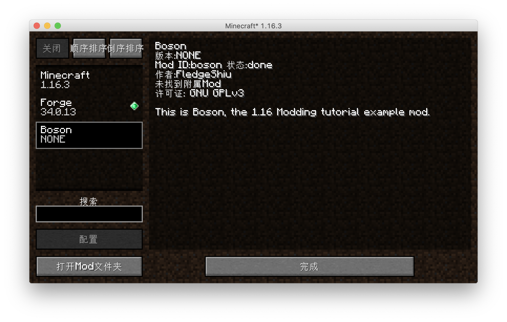

# Customize Mod Info

From this section on we'll be officially writing our mod!

## Updating Mappings

**Forge's Mapping system is in the process of migration, the content of the mapping file will be updated when the MMS system is released, the version we are currently using is `20200916-1.16.2` **

We need change `mappings channel: 'snapshot', version: '20200514-1.16’` in `build.gradle` to `mappings channel: 'snapshot', version: '20200916-1.16.2’`。


Then click the re-import button in the right Gradle panel to re-import the project, because the `build.gradle` file is very important, please be careful not to correct it.


This process may involve downloading files (but not a lot), there is a chance of errors, check your `build.gradle` for errors, and try a few times.

## Configuration

First we select all the directories and files in the `java` folder and then right-click to delete the default classes under the Java package.


Then right-click again to create a new package

By default your package name should be the backwards spelling of your domain name, because I don't want to use my own domain name as an example, so here I'm filling in `com.tutorial.boson`.


Right-click to create a Java class named `Boson`.


This `Boson` is the main class of our Mod.

Next, create a `Utils` class to hold some global constants.

The directory tree after creation is as follows.

```
java
└── com
    └── tutorial
        └── boson
            ├── Boson.java
            └── Utils.java
```

Next let's go to the `Utils` class and define our `modid`, so what is your `modId`? `modId` is the unique identifier of your mod name, please note that `modId` and your mod name are not the same thing, it does not allow capital letters, nor spaces. The `modId` we've chosen here is `boson`.

```java
public class Utils {
    public static final String MOD_ID = "boson";
}
```

Then go to `Boson` and add a `@Mod()` comment to the top of the class name, add the `modid` we defined before. After that, we can add the following:

```java
@Mod(Utils.MOD_ID)
public class Boson {
}
```

Next we need to modify `mods.toml` which is located under `resources/META-INF`. By default, IntelliJ does not syntactically highlight Toml files, so if you need syntax highlighting like I do, you can install the `Toml` plugin.

`mods.toml` is the configuration file for our mods, where we can modify the name, introduction, etc. of our mods. There are many configuration items, if a configuration item has `#mandatory` in the comment, it means it is required, if the injection is `#optional`, it means it is optional, you can add `#` in front of the configuration item to comment out the item.

Becasue the most readers of this verison of Boson are English speaker. You can understand  comments. So just read the commnet to understand the function of configuration.

The rest are all dependencies, and Forge's official examples are clearly written, so we won't elaborate here.

The `mods.toml` I finished modifying is as follows:

```toml
modLoader="javafml" 
loaderVersion="[34,)" 
license="GNU GPLv3"
[[mods]]
modId="boson" 
version="${file.jarVersion}" 
displayName="Boson"
authors="FledgeShiu" 
description='''
This is Boson, the 1.16 Modding tutorial example mod.
'''
```

Now that we've finished modding our mod info, let's open the game.



You can see that our Mod has appeared!

