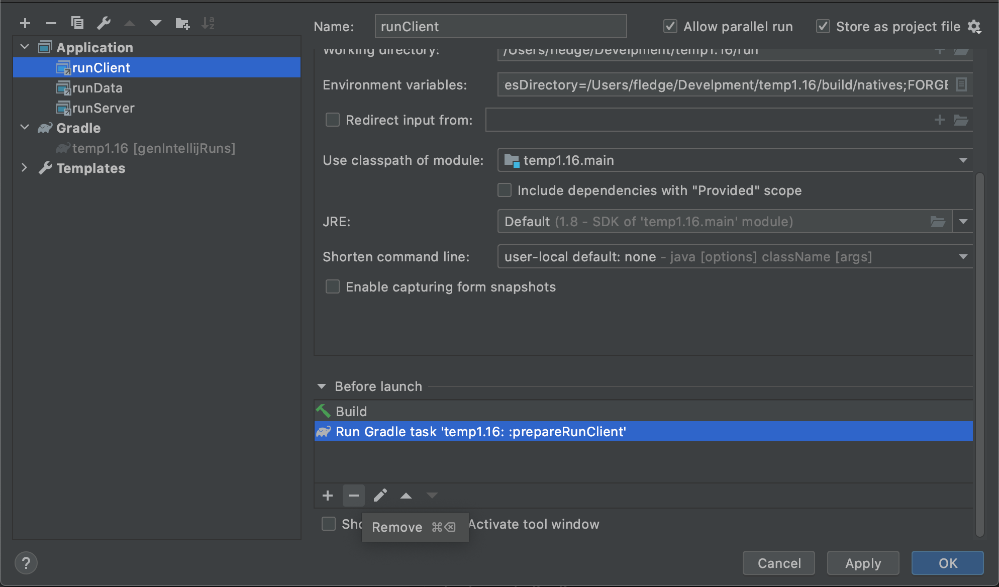
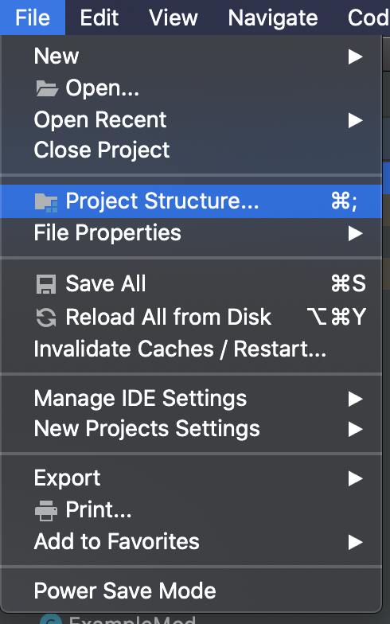

# Setup Environment

## Required Tools

-  [AdoptOpenJDK8-HotSpot](https://adoptopenjdk.net/?variant=openjdk8&jvmVariant=hotspot) For compatibility reasons, **make sure you have JDK8 HotSpot** installed.
-  [IntelliJ IDEA 2020 Community Edition](https://www.jetbrains.com/idea/download/), please install it yourself after the download is complete.
-  [Forge MDK 1.16.3 34.1.0](https://files.minecraftforge.net/maven/net/minecraftforge/forge/1.16.3-34.1.0/forge-1.16.3-34.1.0-mdk.zip), download and extract it to your favorite folder.

## Overview

Minecraft Forge is a Gradle project, Gradle is a project builder tool, its main role is responsible for the project's dependency management, build and other functions. Dependency management refers to help you automatically download and configure the libraries you use in development, that is, the code written by others to facilitate your own development. Build refers to the mods you write into a package that others can install as a jar file.

Forge officially wrote a plug-in called ForgeGradle (henceforth referred to as FG) to take care of the configuration of the entire mod development environment.

## Start Configuring

**It is highly recommended to use the official launcher to start the 1.16.3 game once before starting the configuration to reduce network downloads during the environment configuration process and speed up the speed and success of the environment configuration**.

First select `Open or Import` for the startup page.

Select the `build.gradle` in the directory where your MDK was extracted to open it.

Select as `Open As Project'

Once opened, it will take longer or shorter to import, depending on your network and your own computer.

When the import is complete, click the `build` panel at the bottom, and the green tick on the left side indicates the import was successful.

Before proceeding to the next step, I recommend adjusting IntelliJ's settings for Gradle to speed up the game launch afterwards.

Open the IntelliJ settings interface, find the `Gradle` tab, change the `Build and using` from `Gradle` to `IntelliJ IDEA`, and click `Apply` to save.

By default, MDK sets the logging level is `debug` level, the output of this logging level is too much, it is not convenient for us to view the logs in the development, it is recommended to adjust to `info` level.

Open your `build.gradle` file and change all `property 'forge.logging.console.level', ‘debug’` to `property 'forge.logging.console.level', ‘info’`.

When you are done, click on the `Gradle` panel on the right side of the run, and select `genIntelliJRuns` under `fg_runs` in `Tasks`.

In this step, some of the remaining dependencies will be automatically downloaded, as well as Minecraft resource files. If you've launched the corresponding version of Minecraft with the official launcher before, this process will automatically copy the local cache, which will drastically reduce the download time. If you get an error during this process, basically just re-run `genIntelliJRuns` and it will fix it.

Similarly, when "Green Tick" is displayed on the left side, the configuration is successful.

Click `Run=>Edit Configurations` at the top.

Select the three items under `Application` and delete all tasks from `Before Launch` except `Build`.

Then select `runClient` to start the game.

You can see that our game started successfully, and if you've followed the tutorial before and adjusted Gradle's settings, it shouldn't be very slow.

To make it easier to create directories and sub-packages later, unselect "Compose Package" and "Compress Empty Middleware" as shown below.

## JDK Common Errors

If you have multiple JDKs on your computer, it's possible that the JDK automatically selected by IntelliJ is wrong, making it impossible to import, and you'll need to manually modify the project's JDK and the JDK needed to run Gradle.

Select `Porject Strucutre` under `File`.

Changing the project JDK to version 1.8

