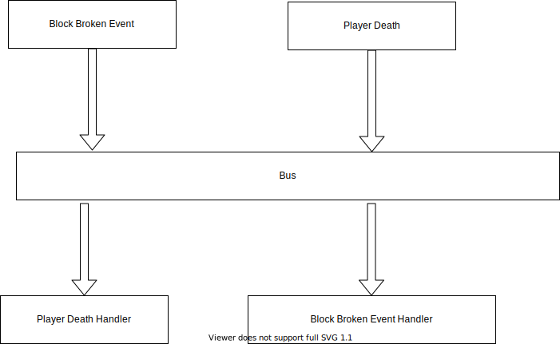

# Development Model

In this section, we're going to talk about what Minecraft mod development model looks like in rough terms, and understanding this model will help you understand what a lot of the actions in mod development are for.

In my opinion, Minecraft mod development basically follows "event-driven model", and we won't go into detail about what "event-driven model" is, you just need to have an basic understanding of it.

So what does Minecraft's "event-driven mode" look like? To answer this question, we need to clarify three concepts: "event", "bus" and "event handler".

What is an "event" in the first place? As the word implies, "event" means "something happened". For example, "When a block is broken" is an event, "When a player dies" is an event, but examples are very specific, and events can be very abstract.

What is an "event handler" then? An event handler is a function used to handle "events". We can create an event handler to handle a “block destruction event", which reads "recreate a block", and we can register an event handler to handle a "player death event", which reads "place a tombstone".

When an bus occurs, information of event will be sent to bus, and then the bus will select event handler which has listened to the event and execute event handler.

Note that the events and event handlers in this diagram are not in order.

There are two buses in Forge development, `Mod bus` and `Forge bus`. All initialization related events are in `Mod bus` and all other events are in `Forge bus`.