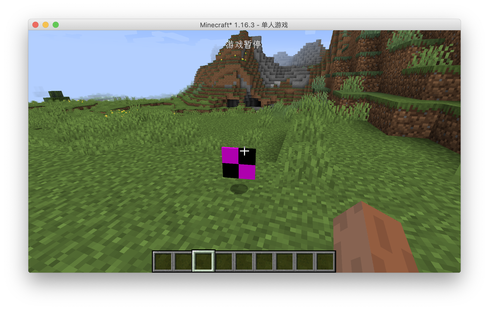

# First Item

From now on we will officially start writing code. First of all, a few things to say, the project's code will be open source, each section of the code links I will put at the back of the article, and for the sake of later amendments and easy to view.

First we have to be clear about which steps are required to create an item. The answer is three steps: create your own item and inherit the class from the original item, instantiate the item, and finally register the item into the game.

Note that these steps above are generic, and many custom content additions follow them.

Once we know the above steps, let's start adding our first item, where we'll add an Obsidian Ingot.

First we need to create an item class and have that class inherit the original `Item` class.

```java
public class ObsidianIngot extends Item {
    public ObsidianIngot() {
        super(new Properties().group(ItemGroup.MATERIALS));
    }
}
```

The code for this class is very simple, with only one constructor.

The only thing worth mentioning here is `new Properties().group(ItemGroup.MATERIALS)`, this `Properties` specifies some properties of the item, such as: whether it is food or not, or which item bar the item is in in creation mode.

Here we have created a `Properties` and called the `group` method and passed in `ItemGroup. MATERIALS`. This adds the item to the original Miscellaneous creation mode item field, but you don't have to call the `group` method.

Next we need to instantiate and register the item, which used to be two separate steps, but Forge has added a mechanism called `DeferredRegister`, which makes it very easy to register an item.

```java
public class ItemRegistry {
    public static final DeferredRegister<Item> ITEMS = DeferredRegister.create(ForgeRegistries.ITEMS, Utils.MOD_ID);
    public static final RegistryObject<Item> obsidianIngot = ITEMS.register("obsidian_ingot", ObsidianIngot::new);
}

```

That's all there is to register, first we create a variable of type `DeferredRegister<Item>` named `ITEMS`, which is a generic type indicating that the thing we need to register is the item, and then by `new DeferredRegister<>(ForgeRegistries.ITEMS Utils.MOD_ID);` instantiates this class, which has two arguments `ForgeRegistries.ITEMS` representing the item we want to register, and the second argument filled in should be your `modId`. We've created our registrar, and the next step is to register our item.

Remember what I said before? You need two things to register, one is the "register name", and the other is the instance of the object you want to register, the two arguments in `ITEMS.register` correspond to these two things.

```java
public static final RegistryObject<Item> obsidianIngot = ITEMS.register("obsidian_ingot", ObsidianIngot::new);
```

The first argument is very easy to understand, `obsidian_ingot` corresponds to the registration name, please note that the registration name here also do not use capital letters, because the second argument here needs a type is a `Supplier`, here we put directly on the `ObsidianIngot` class of the method of construction of the method reference on, if you are not familiar with this syntax, please first at least understand the Java8 functional programming related to the content.

You see, even though we didn't declare the variables explicitly, we still instantiated the class of our item when we registered it.

There's one last step left and we're ready to add items successfully.

```java
@Mod(Utils.MOD_ID)
public class Neutrino {
    public Neutrino() {
        ItemRegistry.ITEMS.register(FMLJavaModLoadingContext.get().getModEventBus());
    }
}
```

We have added a line of code to the build method of the `Mod` main class, `FMLJavaModLoadingContext.get().getModEventBus();` which means get `Mod` bus, if you don't know what `Mod` bus is please scroll ahead. And `ITEMS.register(FMLJavaModLoadingContext.get().getModEventBus());` means to register `ITEMS` into `Mod` bus. Why register `ITEMS` into the `Mod` bus? The reason is that `DeferredRegister` is based on an event system implementation.

At this point, the code needed to add the items we want to add has been written, so open the game and take a look.




The item is still ugly, but that's our first item.

[源码链接](https://github.com/FledgeXu/BosonSourceCode/tree/master/src/main/java/com/tutorial/boson/first_item)