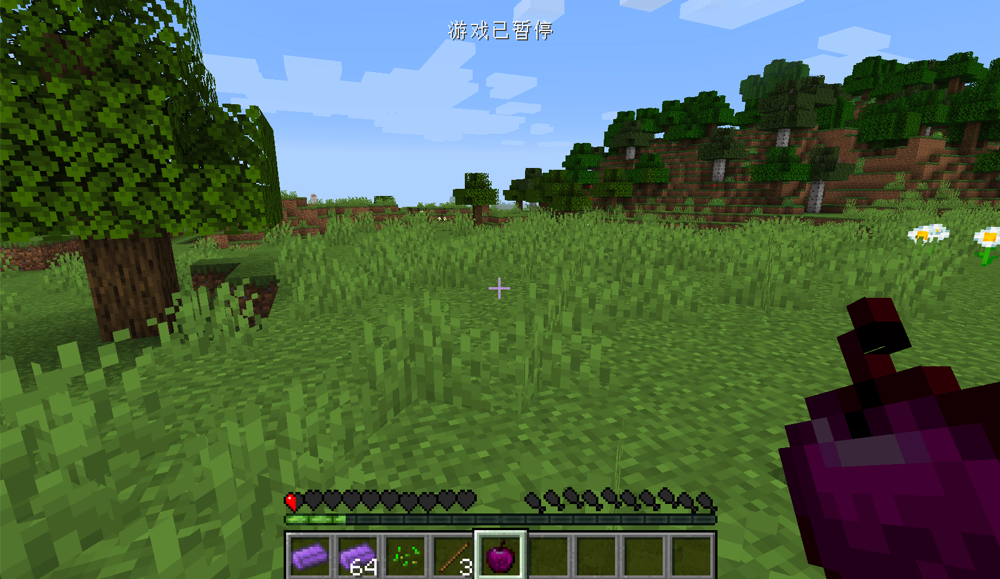

# Food

In this section we will add a new food to the Minecraft world: the Obsidian Apple, after eating this apple you can reply to hunger, but it will be poisoned. Contrary to what many people think, food is not a separate thing, it's just a special item for Minecraft.

Again, let's create a class that inherits `Item`.

```java
public class ObsidianApple extends Item {
    private static final Food food = (new Food.Builder())
            .saturation(10)
            .hunger(20)
            .effect(() -> new EffectInstance(Effects.POISON, 3 * 20, 1), 1)
            .build();

    public ObsidianApple() {
        super(new Properties().food(food).group(ItemGroup.FOOD));
    }
}
```

We explain one line by one line.

We created a variable of type `Food`, which specifies some properties of this food, such as: `saturation` method sets the satiety level, `hunger` sets the hunger level to be restored, and `effect` method sets the potion effect that the food may have when eaten .Here we set the effect to `Poisoning`, with a duration of 60 ticks and potion level 1. The second parameter represents the likelihood of the effect triggering (think of the original raw chicken), here we set it to `1` for 100%.

Next up is the construction method, which I'm sure you're already familiar with.The only thing new is the `.food(food)` method, which indicates that the item is a food, and we ended up putting the item in the `food` creative tab.

Then we register our food under the name `obsidian_apple`:

```java
public class ItemRegistry {
    public static final DeferredRegister<Item> ITEMS = DeferredRegister.create(ForgeRegistries.ITEMS, Utils.MOD_ID);
    public static final RegistryObject<Item> obsidianApple = ITEMS.register("obsidian_apple", ObsidianApple::new);
}
```

Then add the model `obsdian_ingot.json`:

```json
{
  "parent": "item/generated",
  "textures": {
    "layer0": "boson:item/obsidian_apple"
  }
}
```

Then the textures `obsidian_apple.png`.


Take out your apples and try to eat them.



[Source Code](https://github.com/FledgeXu/BosonSourceCode/tree/master/src/main/java/com/tutorial/boson/food)

