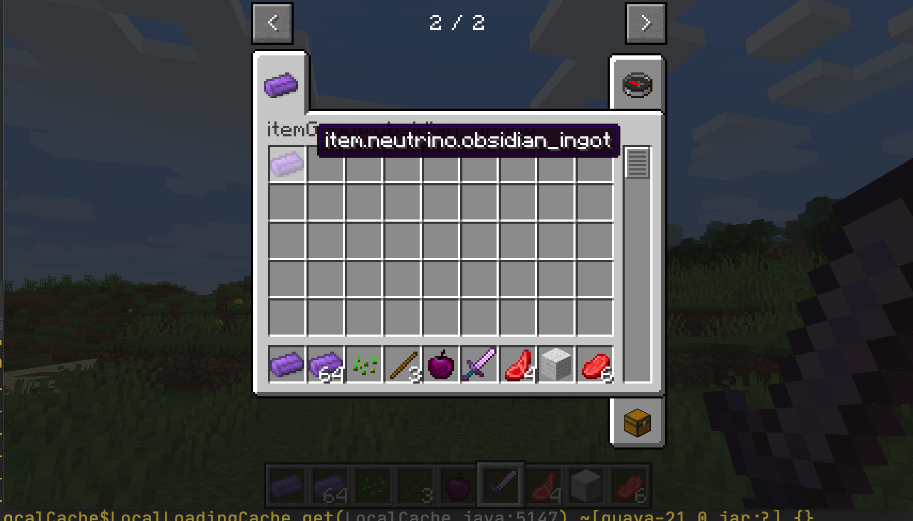

# Item Group

In this section, we'll look at how to create a creative tab of your own, very simply.

First create a class, let it inherit `ItemGroup`, `ItemGroup` on behalf of the creative bar, because we need to create a creative bar, naturally need to inherit it.

It reads as follows:

```java
public class ObsidianGroup extends ItemGroup {
    public ObsidianGroup() {
        super("obsidian_group");
    }

    @Override
    public ItemStack createIcon() {
        return new ItemStack(ItemRegistry.obsidianIngot.get());
    }
}
```

The first method is used to set the title name of the creative bar, and the second provides the icon for the creative bar. Here we have used Obsidian Ingot as the icon, please note that the return value type of this function is `ItemStack`, not `Item`.

Then we need to instantiate the class and create `ModGroup`.

```java
public class ModGroup {
    public static final ItemGroup itemGroup = new ObsidianGroup();
}
```

This is where we store instances of `ItemGroup` and its subclasses (such as `ObsidianGroup`, which we created earlier). Each instance here represents a creative bar in the game.

It's also very easy to call the creative tab after you've created it, let's take Obsidian Ingot for example.

```java
public class ObsidianIngot extends Item {
    public ObsidianIngot() {
        super(new Properties().group(ModGroup.itemGroup));
    }
}
```

At this point open the game our Obsidian Ingot should be in the designated creative tab .



[Soruce Code](https://github.com/FledgeXu/BosonSourceCode/tree/master/src/main/java/com/tutorial/boson/group)

