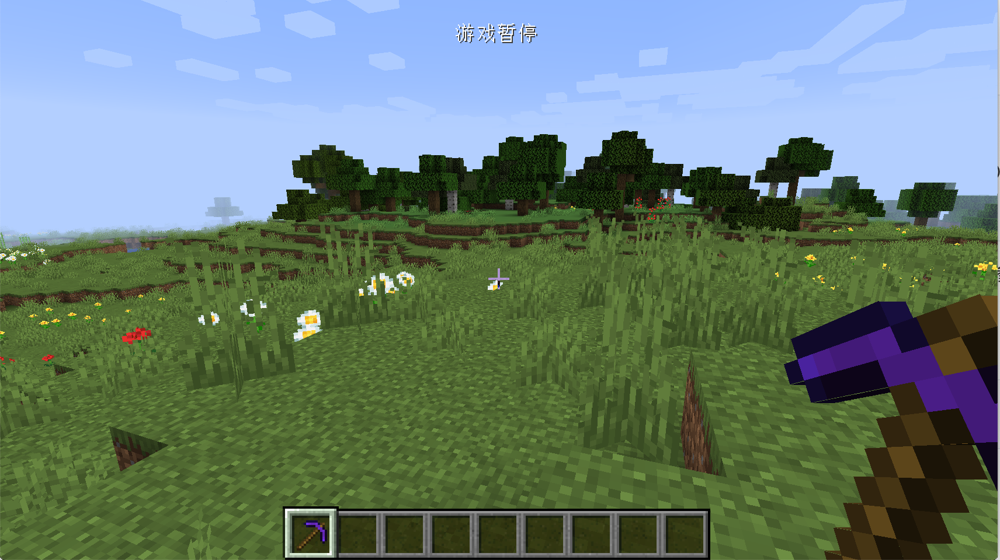

# Tools

In this section, we'll learn how to add a new tool, and here's an example of a new pickaxe.

Let us first observe the inheritance tree.


You can see that the original version has provided classes corresponding to 4 tools, and there is a `ToolItem` on top of these tools. If you want to create a new type of tool, you can choose to inherit and implement this class. Please refer to the original version for the implementation method 4 categories.

Next we begin to create the obsidian pickaxe

```java
public class ObsidianPickaxe extends PickaxeItem {
    public ObsidianPickaxe() {
        super(ModItemTier.OBSIDIAN, 2, -3f, (new Item.Properties()).group(ModGroup.itemGroup));
    }
}
```

As you can see, here we choose to directly inherit the `PickaxeItem` class, and then pass directly we create a good obsidian `ItemTier`, the rest of the parameters, please refer to the original implementation.

And then there's registration.

```java
public static final RegistryObject<Item> obsidianPickaxe = ITEMS.register("obsidian_pickaxe", ObsidianPickaxe::new);
```

Adding textures and models is not something I'll go into here.

Open up the game and take a look, and you should be able to see the brand new Obsidian pickaxe.



[Source Code](https://github.com/FledgeXu/BosonSourceCode/tree/master/src/main/java/com/tutorial/boson/tool)