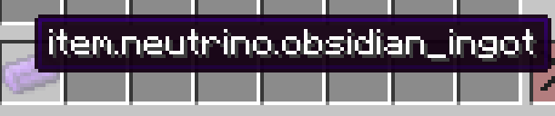
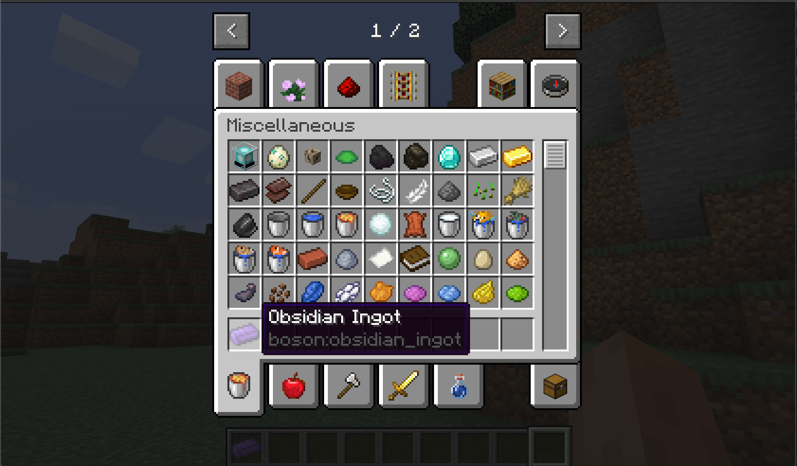

# Localization

In this section, we will learn how to add names to our items.

In the previous chapters, the names of the items we created looked like a string of meaningless characters. In this section we will add a meaningful name to them.

In Minecraft, the name of the file is provided in the form of a language file. In the higher version, the language file is a json file. Its approximate content is as follows:

```json
{
  "language.name": "English",
  "language.region": "United States",
  "language.code": "en_us",
  "narrator.button.accessibility": "Accessibility",
  "narrator.button.language": "Language"
}
```

You can see that a language file is actually a "key-value pair", where the "key" is an in-game number, and the "value" is the specific translation. The reason for this is that Minecraft has to support languages of many countries and regions. If each language is directly hardcoded into the game, it is obviously not maintainable. By default, if you do not add a corresponding translation to the object that needs to be translated in the game, then it will display the "key" of this translation by default.

Take our Obsidian Ingot for example:

 

We haven't added a name to it yet. The `item.neutrino.obsidian_ingot` it displays is the default key value. Of course, you can also customize the key value. There are corresponding methods in the Item class to achieve this. As I said before, in the Minecraft source code and the function name guessing function is a necessary ability for Mod development, so here It is equivalent to a small test, please find a way to modify this key by yourself.

But in some cases, the game cannot automatically add keys to my content by default. At this time, we have to create a key by ourselves. Minecraft provides a method called `I18n.format` for me to create it by myself. For the specific usage, we I will talk about it later.

Let me create the language file.

First, create a folder called `lang` under the `boson` folder. After the creation is successful, the directory tree is as follows:

```
resources
├── META-INF
│   └── mods.toml
├── assets
│   └── boson
│       ├── lang
│       ├── models
│       │   └── item
│       │       ├── obsidian_apple.json
│       │       ├── obsidian_ingot.json
│       │       └── obsidian_sword.json
│       └── textures
│           └── item
│               ├── obsidian_apple.png
│               ├── obsidian_ingot.png
│               └── obsidian_sword.png
└── pack.mcmeta
```

Here we take English as an example.

First create a file called en_us with the following content.

```json
{
  "item.neutrino.obsidian_ingot": "Obsidian Ingot",
  "item.neutrino.obsidian_apple":"Obsidian Apple",
  "item.neutrino.obsidian_sword":"Obsidian Sword",
  "itemGroup.obsidian_group": "Obsidian Tab"
}
```

Then start the game, adjust to simplified Chinese, you should be able to see our items are translated.



A list of all available language files can be found in the Wiki’s [Language#Available languages](https://minecraft.gamepedia.com/Language#Available_languages).