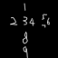
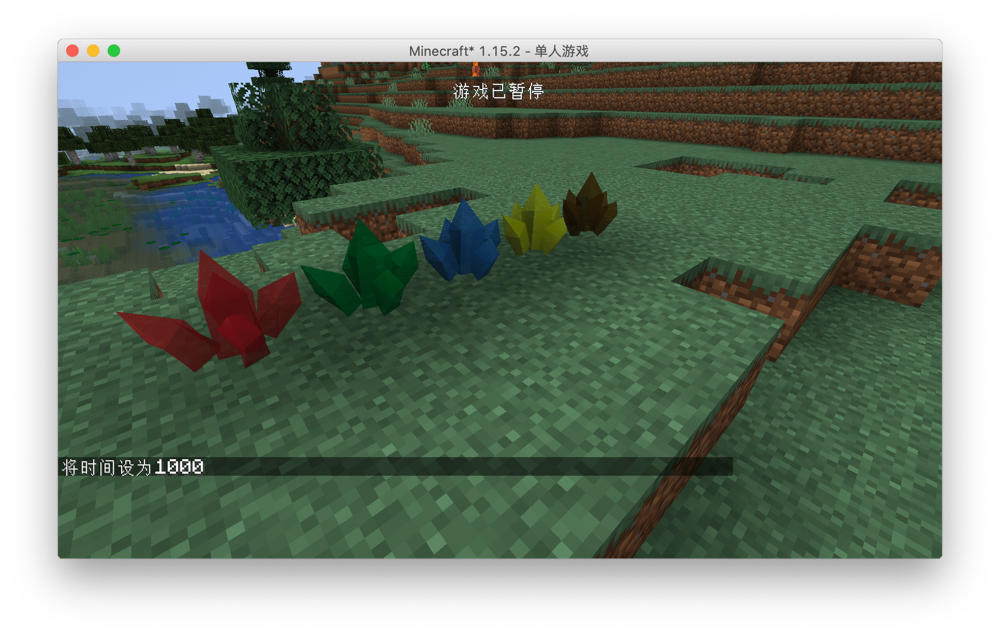
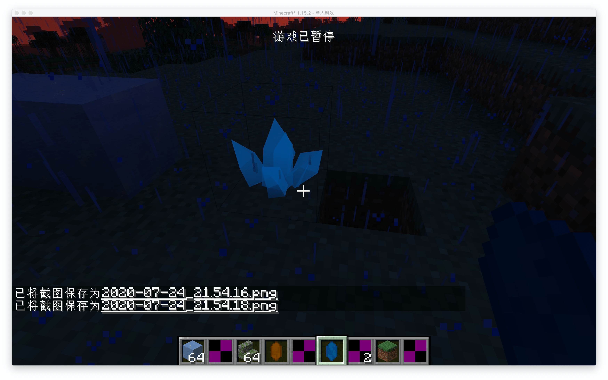

# OBJ Model

In this section we will learn how to add an OBJ item model to the block

First create our block `ObsidianOBJ.java`:

```java
public class ObsidianOBJ extends Block {
    public ObsidianOBJ() {
        super(Properties.create(Material.ROCK).hardnessAndResistance(5).notSolid());
    }
}
```

It is consistent with the method created before, because the model we created is not solid, so the `notSolid` method is added.

Registry Block:

```java
public static final RegistryObject<Block> obsidanObj = BLOCKS.register("obsidian_obj", ObsidianOBJ::new);
```

Registry Item：

```java
public static final RegistryObject<Item> obsidianObj = ITEMS.register("obsidian_obj", () -> new BlockItem(BlockRegistry.obsidanObj.get(), new Item.Properties().group(ModGroup.itemGroup)));
```

BlockState file `obsidian_obj.json`

```json
{
  "variants": {
    "": { "model": "boson:block/obsidian_obj" }
  }
}
```

Model's json file `obsidian_obj.json`

```json
{
  "loader": "forge:obj",
  "model": "boson:models/block/obsidian_obj.obj",
  "flip-v": true
}
```

As you can see, it is a bit special from here. First, we use `loader` to specify that the model we want to load is in `obj` format, then specify our OBJ model in `model`, and finally `flip -v` is set to `true`. The reason for this is that the textures in minecraft and your material in blender and other tools are upside down, so you have to manually flip your textures.

Next is the OBJ model `obsidian_obj.obj`, here only the places that need to be modified are marked:

```
mtllib obsidian_obj.mtl
```

You must specify the name of the mtl file you want to use here.

Next is the mtl file `obsidian_obj.mtl`. Similarly, I only mark the places that need to be modified here.

```
map_Kd boson:block/obsidian_obj
```

You must specify the material of your model file in this way.

Finally, our material `obsidian_obj.png`:




You can see that our OBJ model has been successfully loaded. Of course, we haven't set up the correct collision box here, and this is left to the reader to implement.

Items can also use the OBJ model, please explore by yourself.

[Source Code](https://github.com/FledgeXu/BosonSourceCode/tree/master/src/main/java/com/tutorial/boson/obj)

---

## Common Problem and Solutions

### Ambient light 

By default, you may find that your model has unnatural black shadows like the picture below. This is caused by ambient light occlusion. You can modify the block by overwriting the `getAmbientOcclusionLightValue` method under the `Block` class Ambient light occlusion, the default is `0.2`, and the maximum value is `1`. The larger the value, the smaller the ambient light occlusion.



## Unnatural highlights at night

Sometimes you will find that your model will emit unnatural highlights like this at night. This is caused by the extra attributes in the `mtl` file. For Mod development, it is recommended to keep only the `map_Kd` attribute. For details, please see IE [mtl file](https://github.com/BluSunrize/ImmersiveEngineering/blob/1.14/src/main/resources/assets/immersiveengineering/models/block/balloon.mtl).



---

## Modding Crash Course

If you are using Blender to make an OBJ model, please set the center point of your model to `X:0.5m,Y-0.5m,Z:0.5`, so you don't need to perform additional offset calculations in the json file . A full cube in Minecraft is exactly `1m*1m*1m` in Blender.

