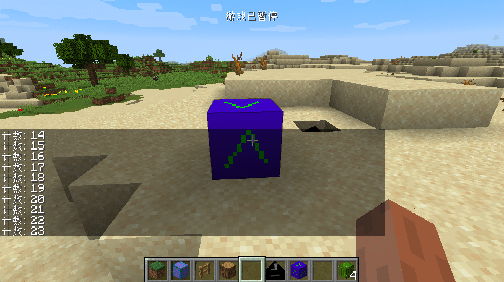

# First TileEntity and Data Storage

In this section, we will learn how to create a block entity of our own. Let’s take a counter as an example. Its only function is to increase by one when you right-click the block, and then send the corresponding one to your chat box value.

First, let's create our Block `ObsidianCounter.java`:

```java
public class ObsidianCounter extends Block {
    public ObsidianCounter() {
        super(Properties.create(Material.ROCK).hardnessAndResistance(5));
    }

    @Override
    public boolean hasTileEntity(BlockState state) {
        return true;
    }

    @Nullable
    @Override
    public TileEntity createTileEntity(BlockState state, IBlockReader world) {
        return new ObsidianCounterTileEntity();
    }

    @Override
    public ActionResultType onBlockActivated(BlockState state, World worldIn, BlockPos pos, PlayerEntity player, Hand handIn, BlockRayTraceResult hit) {
        if (!worldIn.isRemote && handIn == Hand.MAIN_HAND) {
            ObsidianCounterTileEntity obsidianCounterTileEntity = (ObsidianCounterTileEntity) worldIn.getTileEntity(pos);
            int counter = obsidianCounterTileEntity.increase();
            TranslationTextComponent translationTextComponent = new TranslationTextComponent("message.neutrino.counter", counter);
            player.sendStatusMessage(translationTextComponent, false);
        }
        return ActionResultType.SUCCESS;
    }
}
```

We won't go into details about the registration part, here we will talk about a few functions. The first thing to talk about is the set of functions `hasTileEntity` and `createTileEntity` (**Please note that the two methods here are not `@Deprecated`, that is, they are not "crossed" after you rewrite What we need to rewrite is the method under the ʻIForgeBlock` interface, please be careful not to rewrite the wrong method**), this set of functions allows your block to be bound to a block entity, and the return value of `hasTileEntity` is set to `true `, it means that our block has a block entity. The function `createTileEntity` determines which block entity our block is. In our case, it is `ObsidianCounterTileEntity`.

Let's skip the `onBlockActivated` method first to see what is in our block entity.

`ObsidianCounterTileEntity`:

```java
public class ObsidianCounterTileEntity extends TileEntity {
    private int counter = 0;

    public ObsidianCounterTileEntity() {
        super(TileEntityTypeRegistry.obsidianCounterTileEntity.get());
    }

    public int increase() {
        counter++;
        markDirty();
        return counter;
    }
}
```

As you can see, the content in this block entity is very simple, with only one construction method and one `increase` method. The `increase` method is related to the specific content we want to achieve. Here, let's first look at the construction method.

```java
super(TileEntityTypeRegistry.obsidianCounterTileEntity.get());
```

In the construction method here, we passed a `TilEnttityType` to our parent class, so what is this `TilEntityType`? This `TileEntityType` hence the name implies the "type" of the block entity. This "type" specifies how our block entity should be created and which blocks it is bound to. Next we will take a look at our `TilEntityType `How was it created and registered?

Then we created a new class called `TileEntityTypeRegistry`:

```java
public class TileEntityTypeRegistry {
    public static final DeferredRegister<TileEntityType<?>> TILE_ENTITIES = DeferredRegister.create(ForgeRegistries.TILE_ENTITIES, Utils.MOD_ID);
    public static final RegistryObject<TileEntityType<ObsidianCounterTileEntity>> obsidianCounterTileEntity = TILE_ENTITIES.register("obsidian_counter_tileentity", () -> TileEntityType.Builder.create(ObsidianCounterTileEntity::new, BlockRegistry.obsidianCounterBlock.get()).build(null));
}
```

The first is the type, because `TileEntityType` is a generic class, and its generics can contain various `TileEntity`, so when we define `TILE_ENTITIES`, the type in `DeferredRegister` is `TileEntityType<?>`, the question mark here means that various `TileEntityType` such as `TileEntityType<AEntity>` and `TileEntityType<BEntity>` can be registered in `TILE_ENTITIES`.

Then the type of our variable, because we are going to register `TileEntityType` for `ObsidianCounterTileEntity`, so the type we need is naturally `TileEntityType<ObsidianCounterTileEntity>`.

The most complicated thing here should be the specific registration process, but it is not difficult to understand. The same as before, it is the registered name and a registered object. We can split this complicated sentence apart.

```java
TILE_ENTITY_TYPE_DEFERRED_REGISTER.register("obsidian_counter_tileentity",()-> ...);
```

If we omit a series of complicated content inside, the core of this code is such a sentence, I believe everyone can understand this, the key point here is the "..." we omitted.

The previously omitted content is as follows:

```java
TileEntityType.Builder.create(ObsidianCounterTileEntity::new, BlockRegistry.obsidianCounterBlock.get()).build(null));
```

As you can see, here we first call the `TileEntityType.Builder.create` method, which is a method provided by Minecraft to create a `TileEntityType`, and then call the `build` method. Let's first look at the parameters in the `build` method. In `build` we passed in a `null`. In fact, this place can be filled with an instance called `datafix`, which is used to archive different versions before Converted. Here we do not have this requirement (most mods are not expected to be realized), so we fill in a `null`.

Then we look back at the two parameters in `TileEntityType.Builder.create`, the first parameter is a `supplier`, here we fill in the method reference of the construction method of the block entity, and the second type is and For the associated block, here we fill in the instance of our registered `ObsidianCounterBlock`. As for the registration of the block, I believe that the readers here have the ability to solve it by themselves.

This way the content is a lot less at once, but for the convenience of readers' understanding, I still use the above writing method. Of course, don't forget to register `TILE_ENTITIES` in the Mod bus in your Mod main class.

Then we can take a look at our logic

```java
@Override
public ActionResultType onBlockActivated(BlockState state, World worldIn, BlockPos pos, PlayerEntity player, Hand handIn, BlockRayTraceResult hit) {
  if (!worldIn.isRemote && handIn == Hand.MAIN_HAND) {
    ObsidianCounterTileEntity obsidianCounterTileEntity = (ObsidianCounterTileEntity) worldIn.getTileEntity(pos);
    int counter = obsidianCounterTileEntity.increase();
    TranslationTextComponent translationTextComponent = new TranslationTextComponent("message.neutrino.counter", counter);
    player.sendStatusMessage(translationTextComponent, false);
  }
  return ActionResultType.SUCCESS;
}
```

The first is the block's `onBlockActivated` method. Please note that there are two `onBlockActivated` methods with the same name but different return values. Don't rewrite the method wrong.

```java
if (!worldIn.isRemote && handIn == Hand.MAIN_HAND)
```

First of all, we judged whether our method is called on the server side. Remember that any logic that involves data processing should be executed on the server side. In addition, we also judged whether the incoming `handIn` is the "master hand". This judgment is made because this method will be executed once for both hands.

```java
ObsidianCounterTileEntity obsidianCounterTileEntity = (ObsidianCounterTileEntity) worldIn.getTileEntity(pos);
```

Here we call the `worldIn.getTileEntity` method to get the `TileEntity` corresponding to our block. The reason must be called by this method is that even if a block is bound to a TileEntity, you cannot guarantee that this `TileEntity` It must exist.

```java
int counter = obsidianCounterTileEntity.increase();
```

Then we here increase and get the value by calling the `increase` method of our `obsidianCounterTileEntity`.

```java
public int increase() {
  counter++;
  return counter;
}
```

The content of the `increase` method is very simple, I believe everyone can understand it.

```java
TranslationTextComponent translationTextComponent = new TranslationTextComponent("message.neutrino.counter", counter);
```

Then there is this sentence, first we create a `TranslationTextComponent`, here is the content we want to send to the player's chat box. As its name implies, this is a translated text, so it should be a "key" rather than a specific content, `"message.tour14.counter"` is the "key" value, we also passed in later The count value obtained, the reason for this, we first press the table.

First, we add the following content to the language file (take English as an example).

```json
 "message.neutrino.counter": "count: %d"
```

You can see that there is a `%d` here. At this time, the reason why we need to pass in our value is very clear. In fact, the value of our `counter` variable is formatted through `%d` .

```java
player.sendStatusMessage(translationTextComponent, false);
```

Finally, we call this statement and send a message to the player. Please note that because we have judged `!worldIn.isRemote` before, although this code is executed on the server side, because the specific message is displayed on the client side , So we need to send a message to the client by sending a package. Fortunately, Minecraft provides us with this method to send data, so we don’t need to implement it ourselves.



You can see that our block can be successfully counted.

But there is a bug in this block. When you exit the current save and re-enter, you will find that our counter starts counting from 0 again. Next, let's fix this problem.

The reason for this bug is that when the save is running, the value of the counter exists in the memory and can function normally, but when the game is closed, because the important data in the memory is not saved to your hard disk, so open it next time During the game, these data cannot be reloaded and restored. Before our TileEntity did not implement this save and restore function, we will add this function to it next.

The content of the `ObsidianCounterTileEntity` after the addition is as follows:

```java
public class ObsidianCounterTileEntity extends TileEntity {
    private int counter = 0;

    public ObsidianCounterTileEntity() {
        super(TileEntityTypeRegistry.obsidianCounterTileEntity.get());
    }

    public int increase() {
        counter++;
        markDirty();
        return counter;
    }

    @Override
    public void read(BlockState state, CompoundNBT nbt) {
        counter = nbt.getInt("counter");
        super.read(state, nbt);
    }

    @Override
    public CompoundNBT write(CompoundNBT compound) {
        compound.putInt("counter", counter);
        return super.write(compound);
    }
}
```

As you can see, compared to the previous code, we have overwritten the `write` and `read` methods. These two methods are used to save and restore data. In Minecraft, all data should ultimately be saved in NBT format (unless you implement the save method yourself), and the NBT tag in the code is represented by `CompoundNBT`. NBT tags are also a "key-value pair" structure, and each value has a corresponding name. The method at the beginning of `put` is to write a value to the NBT tag, and the method at the beginning of `get` is to get the value. In addition to `CompoudNBT`, there is also the `ListNBT` class to represent the NBT tag of the array type.

The `write` here is the method of data saving. Its incoming value is the NBT tag that has been saved by other classes before, and its return value is the NBT tag that will eventually be saved to the hard disk (there are other classes to write Enter), under normal circumstances, you should call `return super.write(compound);` to do the final return.

The `read` method is just the opposite, here we call the `counter = compound.getInt("counter");` method to restore the data of our counter. Similarly, you should call `super.read(compound);` to do the final return.

Another very important thing is

```java
public int increase() {
  counter++;
  markDirty();
  return counter;
}
```

We have added the `markDirty()` method here. This method means to mark our data as modified so that the game knows to save and call the save method when it is closed. This is because compared to the execution speed of the CPU, the saving and reading and writing speed of the hard disk is very slow, so if frequent saving and reading and writing operations will seriously slow down the speed of the game, a reasonable way is to mark that we need to save The data is then saved together at a unified point in time, the role of `markDirty()` is exactly this.

[Source Code](https://github.com/FledgeXu/BosonSourceCode/tree/master/src/main/java/com/tutorial/boson/first_tileentity)

