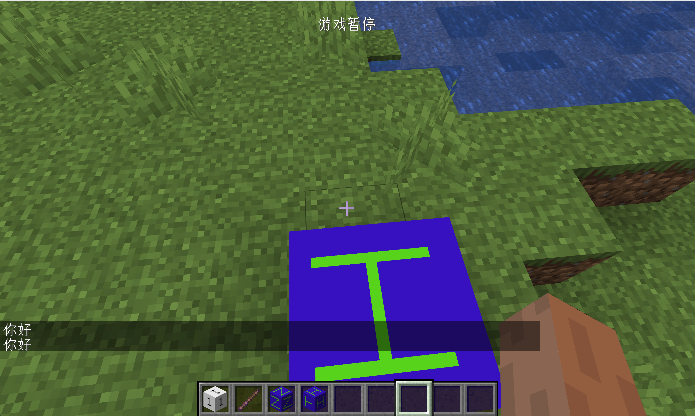

# ITickableTileEntity

In this section, we will learn about one of the most important interfaces in TileEntity: `ITickableTileEntity`.

In this section, we will take the creation of a box that automatically greets us as an example to reflect the function of this interface.

`ObsidianHelloBlock`:

```java
public class ObsidianHelloBlock extends Block {
    public ObsidianHelloBlock() {
        super(Properties.create(Material.ROCK).hardnessAndResistance(5));
    }

    @Override
    public boolean hasTileEntity(BlockState state) {
        return true;
    }

    @Nullable
    @Override
    public TileEntity createTileEntity(BlockState state, IBlockReader world) {
        return new ObsidianHelloTileEntity();
    }
}
```

`ObsidianHelloTileEntity`:

```java
public class ObsidianHelloTileEntity extends TileEntity implements ITickableTileEntity {
    private static final int MAX_TIME = 5 * 20;
    private int timer = 0;

    public ObsidianHelloTileEntity() {
        super(TileEntityTypeRegistry.obsidianHelloTileEntity.get());
    }

    @Override
    public void tick() {
        if (world != null && !world.isRemote) {
            if (timer == MAX_TIME) {
                PlayerEntity player = world.getClosestPlayer(pos.getX(), pos.getY(), pos.getZ(), 10, false);
                TranslationTextComponent translationTextComponent = new TranslationTextComponent("message.hello_block.hello");
                if (player != null) {
                    player.sendStatusMessage(translationTextComponent, false);
                }
                timer = 0;
            }
            timer++;
        }
    }
}

```

In fact, the code of this block entity is much simpler than the code of the first block entity we made. You can see that we have implemented the `ITickableTileEntity` interface here. This interface has only one method that needs to be implemented, which is the `tick` method, so the name implies. This will be executed once in each game tick. We have made a counter here, and then The nearest player within 10 block around the block position is obtained through the `world.getClosestPlayer` method, and then a `TranslationTextComponent` message is created, and finally `player.sendStatusMessage` is called to send the message to the player, and the `sendStatusMessage` accepts `ITextComponent` interface.

Don't forget the translation of language files:

```json
"message.hello_block.hello": "Hello"
```

Register `TileEntityType`:

```java
public static RegistryObject<TileEntityType<ObsidianHelloTileEntity>> obsidianHelloTileEntity = TILE_ENTITIES.register("obsidian_hello_tileentity", () -> TileEntityType.Builder.create(ObsidianHelloTileEntity::new, BlockRegistry.obsidianHelloBlock.get()).build(null));

```

The other registration and creation of model files are omitted here, and I believe that readers have the ability to complete them independently.

Open the game and get close to the block

You can see that our block is greeting us.



[源代码](https://github.com/FledgeXu/BosonSourceCode/tree/master/src/main/java/com/tutorial/boson/tickabletileentity)

